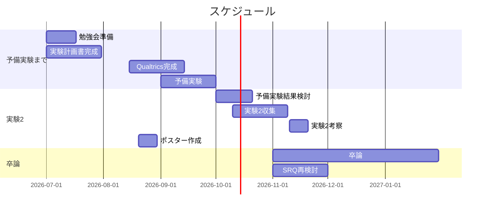

# スケジュール
随時追記


# B4春議事録
## GRQ・SRQ・研究のアプローチ
### GRQ
```
LINEでの感情表現記号が
印象形成に及ぼす影響を明らかにする
```

### SRQ
```
LINE のトーク機能において、LINE 特有の
命題内容に寄与しない文末の感情表現記号は
読み手の印象形成にどのような影響をもたらすか？
（変更点）
1. 大学生の文言追加
2. 
```

### 研究のアプローチ
- LINEの**文末表現記号の収集**（実験1）
  - 実際に大学生の間で使われている文末表現記号を収集し、分類する。
- LINEの文末表現記号による**印象評価実験**
  - 実際にLINEの文末表現記号を刺激とした印象評価実験を行う。
  - 印象評価実験には7因子を用いる
    - **ビッグファイブ**（外向性、友好性、誠実性、神経質性、開放性）
    - **心理的距離感**
    - 関係形成意図
      - テキストメッセージにおける印象形成において、読み手に知覚される専門性と真実性によって構成されるコミュニケーターの信頼性は重要であるとされている。

