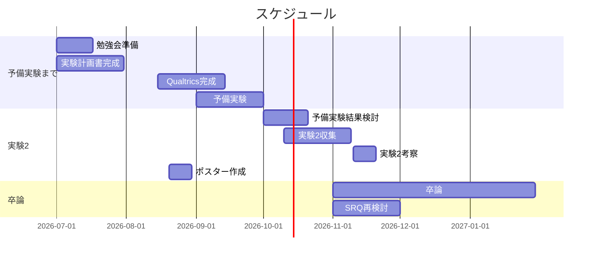

# スケジュール
随時追記


# B4春議事録
## GRQ・SRQ・研究のアプローチ
### GRQ
```
LINEでの感情表現記号が
印象形成に及ぼす影響を明らかにする
```

### SRQ
```
LINE のトーク機能において、LINE 特有の
命題内容に寄与しない文末の感情表現記号は
読み手の印象形成にどのような影響をもたらすか？
```

### 研究のアプローチ
- LINEの**文末表現記号の収集**（実験1）
  - 実際に大学生の間で使われている文末表現記号を収集し、分類する。
- LINEの文末表現記号による**印象評価実験**
  - 実際にLINEの文末表現記号を刺激とした印象評価実験を行う。
  - 印象評価実験には7因子を用いる
    - **ビッグファイブ**（外向性、友好性、誠実性、神経質性、開放性）
    - **心理的距離感**
    - **関係形成意図**
      - テキストメッセージにおける印象形成において、読み手に知覚される専門性と真実性によって構成されるコミュニケーターの信頼性は重要であるとされている。

# 第1回GM 10/5
## 進捗
### LINEトーク画面刺激の妥当性検討
実験2で使用するLINEトーク画面刺激について、
文末感情表現記号以外の要素が印象形成に与える影響を可能な限り統制するため、
場面設定・プロフィール画像・表示名等の設定根拠を検討した。
(夏合宿のポスターセッションを踏まえて)

#### 感謝・謝罪場面と敬語・常体
- 竹原・栗林（2006）は、感謝場面・謝罪場面について、丁寧体・普通体のメッセージで送り手の印象形成への影響を検討している
    ```
  【参考文献】
    竹原 卓真・栗林 克匡（2006）．様々なエモティコンを付加した電子メールが受信者の印象形成に及ぼす効果―感謝と謝罪場面の場合―．*感性工学研究論文集, 6*(4), 83–90．https://doi.org/10.5057/jjske2001.6.4_83
    ```
- 北村・佐藤（2009）でも、携帯メールにおける絵文字の効果とメッセージのフォーマリティとの関係が検討されている。
    ```
  【参考文献】
    北村 英哉・佐藤 重隆（2009）．携帯メールへの絵文字付与が女子大学生の印象形成に与える効果．*感情心理学研究, 17*(2), 148–156．https://doi.org/10.4092/jsre.17.148
    ```
- 本研究でも以下の場面、文体を設定する。(先行研究に倣って)
    - 場面：感謝 / 謝罪
    - 文体：敬語 / 常体

#### 具体的な場面設定
- 竹原・栗林（2006）では「レポート課題」のような詳細なシチュエーションまでは設定されていない。
- Experimental Vignette Methodology（EVM：実験的ヴィネット法）では、一定の具体性を持つシナリオを提示する方法が用いられる。
    - 実際の状況との類似性？や、参加者がその場面の没入度？を高めること
        - 協力者にも想像しやすいような場面設定を心がける
    - 共通した文脈を与える情報は入れるが、研究上必要のない情報は増やさない
        - なるべく簡潔で、印象形成に影響を与えるようなものを考えない
  ```
  【参考文献】
  Aguinis, H., & Bradley, K. J. (2014). Best practice recommendations for designing and implementing experimental vignette methodology studies. *Organizational Research Methods, 17*(4), 351–371. https://doi.org/10.1177/1094428114547952
  ```

- 本研究では、参加者ごとに異なる感謝・謝罪場面を想像することを避けるため、大学生が想像しやすいレポート課題という共通の文脈を設定する。
    - 大学生が想像しやすい
    - 感謝・謝罪が自然に生じる
    - 出来事が重大すぎない
    - Aさんの性格・能力を直接推測させにくい
    - 9種類の文末感情表現記号が極端に不自然にならない

#### プロフィール画像
- オンライン上では、プロフィール画像・アバターの視覚的特徴自体が人物の信頼性や魅力等の印象形成に影響することが示されている。
  ```
  【参考文献】
  Nowak, K. L., & Rauh, C. (2005). The influence of the avatar on online perceptions of anthropomorphism, androgyny, credibility, homophily, and attraction. *Journal of Computer-Mediated Communication, 11*(1), 153–178. https://doi.org/10.1111/j.1083-6101.2006.tb00308.x
  ```

- 顔・性別・趣味等を想起させる情報を減らす目的で、無彩色を基調とした抽象的なプロフィール画像を使用する方向で検討。

## 相談事項

- プロフィール画像は人物情報を減らした無彩色・抽象的なものとする方針でよいか。
- 表示名を「A」とする場合、プロフィールアイコン内にも「A」を表示する必要があるか。
- 文末感情表現記号以外に、LINEトーク画面上で統制すべき要素は他にあるか。


## Todo
- 必要に応じて予備実験で刺激の自然さ・アイコンの印象を確認する
- 刺激仕様確定後、36種類のLINEトーク画面刺激を作成する
